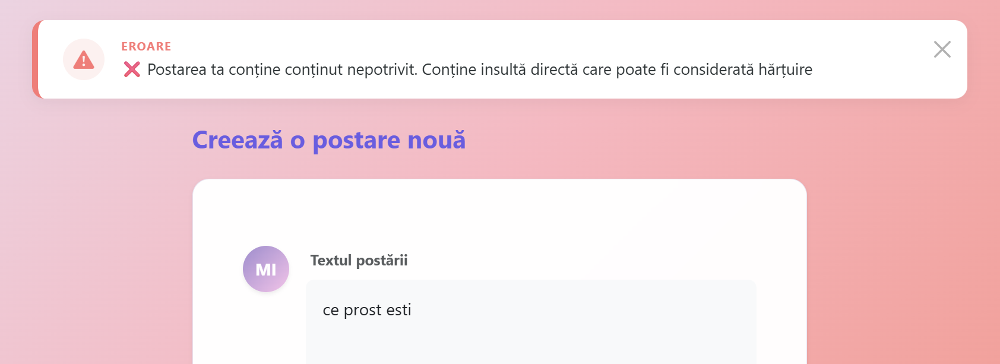
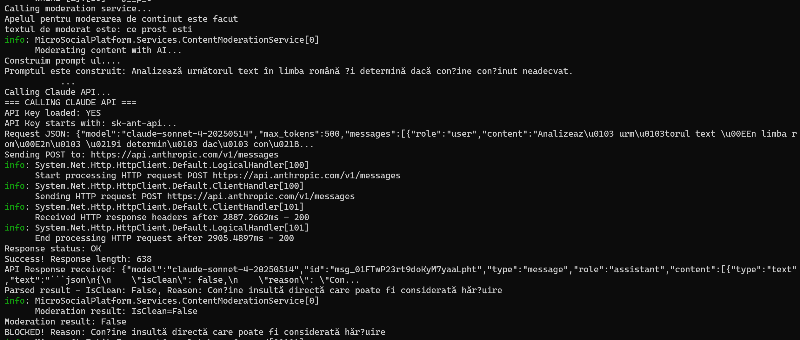
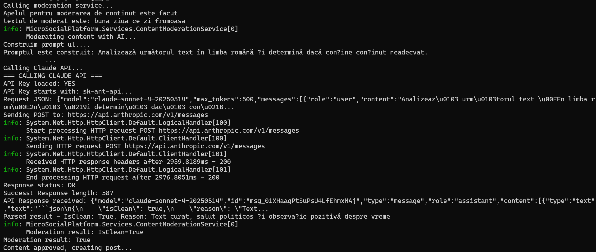
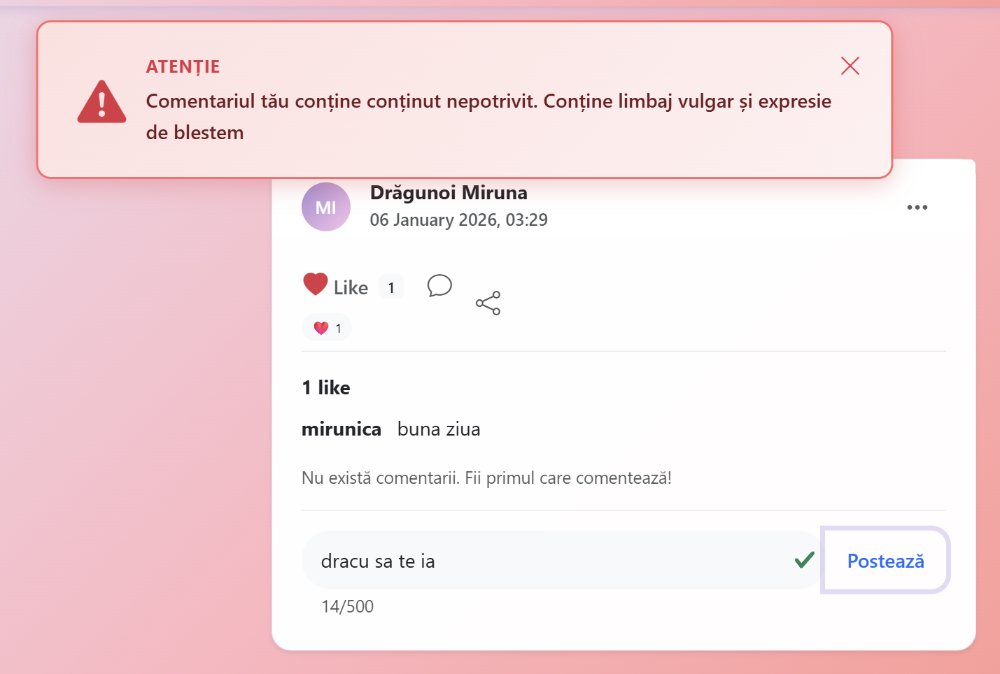
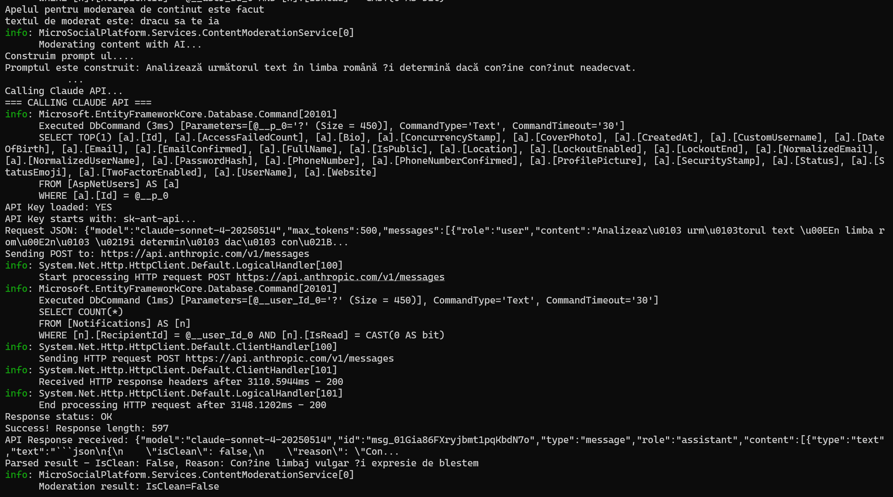
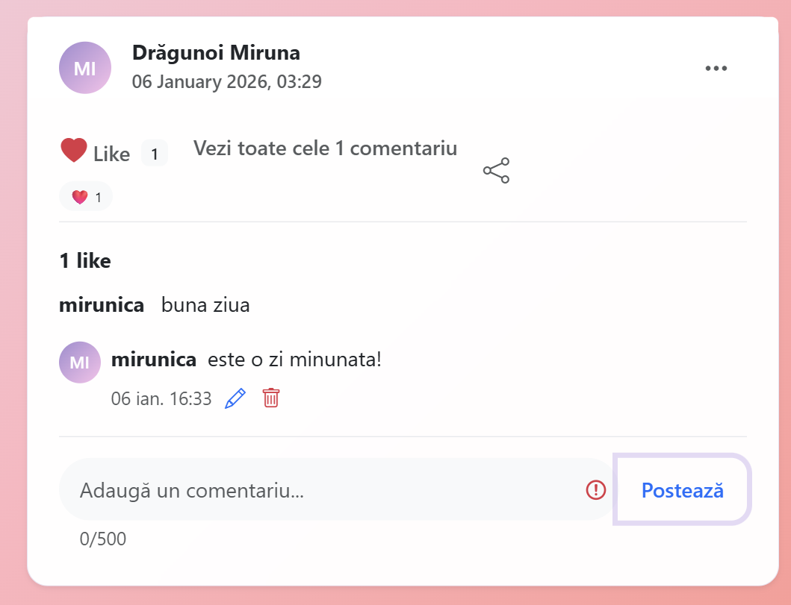

# Documentație - Componentă AI pentru Filtrarea Conținutului Neadecvat

---

## Cuprins

1. [Ce am Realizat](#1-ce-am-realizat)
2. [De ce Era Necesar](#2-de-ce-era-necesar)
3. [Cum funcționează](#3-cum-funcționează)
4. [Tehnologii Folosite](#4-tehnologii-folosite)
5. [Implementarea Pas cu Pas](#5-implementarea-pas-cu-pas)
6. [Rezultate și Testare](#6-rezultate-și-testare)

---

## 1. Ce am Realizat

Am implementat un sistem inteligent care **analizează automat** textul postărilor și comentariilor **înainte** de a fi publicate pe platformă. 

### Funcționalități Principale

**Detectare automată** a conținutului neadecvat (insulte, limbaj vulgar, hate speech)  
**Blocare instantanee** a publicării dacă textul conține probleme  
**Feedback clar** pentru utilizator cu explicația motivului blocării  
**Fără intervenție umană** - totul se întâmplă automat în sub 3 secunde  

---

## 2. De ce Era Necesar

### Problema

Platformele sociale se confruntă cu provocări majore:
- Utilizatori care postează **insulte** și **limbaj vulgar**
- **Hate speech** și conținut discriminatoriu
- **Amenințări** și incitare la violență
- Mediu **toxic** care îndepărtează utilizatorii 

### Soluția Noastră (AI Automat)

**Rapidă** - Verificare în 1-3 secunde  
**Eficientă** - Cost de ~$3.50/lună pentru 100 utilizatori  
**Consistență** - Aceleași reguli pentru toată lumea  
**Scalabilă** - Poate verifica mii de mesaje pe zi  

---

### 3. Cum funcționează

#### Claude API (Anthropic)

**Ce face:**
- Trimite textul către **Claude AI**
- Claude **înțelege contextul** și nuanțele limbajului
- Returnează un răspuns detaliat (OK/Blocat + motivul)

**Avantaje:**
- Acuratețe ~95% (înțelege context, ironie, sarcasm)
- Multilingv (funcționează în multe limbi)
- Se îmbunătățește continuu (model actualizat)
- Detectează chiar și expresii creative de insulte

**Dezavantaje:**
- Cost: ~$0.0014 per verificare ($3.50/lună pentru 100 useri)
- Mai lent: 1-3 secunde
- Necesită internet și API key

### Procesul Complet

**Pas 1: Utilizatorul scrie textul**
```
User completează formularul de postare: "Ești un idiot"
```

**Pas 2: Trimitere către server**
```
Click pe "Postează" › Request către PostController
```

**Pas 3: Validare inițială**
```
Controller verifică dacă formularul e valid (câmpuri obligatorii, etc.)
```

**Pas 4: Apelare serviciu AI**
```
Controller trimite textul către serviciul de moderare:
moderationResult = await _contentModerationService.ModerateContentAsync("Ești un idiot")
```

**Pas 5: Analiza AI**

*Dacă folosim Claude API:*
```
› Construiește un prompt pentru AI:
   "Analizează textul: 'Ești un idiot'"
   "Verifică dacă conține: insulte, limbaj vulgar, hate speech..."
   "Răspunde cu JSON: {isClean: true/false, reason: '...'}"

› Trimite request la Anthropic API

› Claude AI analizează:
   - Context: "Ești un idiot" = insultă directă
   - Nu e glumă, nu e sarcasm
   - Categorie: Insulte

› Returnează: {isClean: false, reason: "Insulte detectate", confidence: 0.98}
```

**Pas 6: Decizie**

*Dacă IsClean = true:*
```
› Salvează postarea în baza de date
› Creează notificări pentru urmăritori
› Redirect către pagina principală
› User vede postarea publicată
```

*Dacă IsClean = false:*
```
› NU salvează postarea
› Setează mesaj de eroare: TempData["ErrorMessage"] = "Conținutul conține insulte..."
› Returnează utilizatorul la formularul de creare
› User vede alert roșu cu explicația
```

---

## 4. Tehnologii Folosite

### Inteligență Artificială

| Serviciu | Detalii |
|---------|---------|
| **Claude AI (Anthropic)** | Model: Sonnet 4 |
| | API: https://api.anthropic.com |
| | Cost: $3 per milion tokens input, $15 per milion output |
| | Acuratețe: ~95% |

### Configurare și Securitate

| Componentă | Detalii |
|-----------|---------|
| **appsettings.json** | Stocare API key pentru Claude |
| **HTTPS** | Comunicare securizată cu API-ul |
| **Headers HTTP** | Autentificare cu `x-api-key` |

---

## 5. Implementarea Pas cu Pas

### Etapa 1: Crearea Structurii de Bază

**Am creat două fișiere fundamentale:**

1. **IContentModerationService.cs** - Interfața care definește ce trebuie să facă serviciul
   - Metodă: `ModerateContentAsync(text)` - verifică un text
   - Returnează: `ModerationResult` - rezultatul verificării

2. **ModerationResult.cs** - Modelul care conține rezultatul
   - `IsClean` (true/false) - e OK sau nu?
   - `Reason` (text) - de ce e blocat?
   - `DetectedIssues` (listă) - ce probleme are?
   - `Confidence` (0-1) - cât de sigur e AI-ul?


### Etapa 2: Implementarea Claude API Service

**Am creat ContentModerationService.cs:**

Acest serviciu comunică cu **Claude AI de la Anthropic**.

**Componentele principale:**

**A. Construirea Prompt-ului**
- Creăm instrucțiuni clare pentru AI
- Specificăm ce trebuie să caute (insulte, hate speech, etc.)
- Cerem răspuns în format JSON structurat

**B. Comunicarea cu API-ul**
- Folosim `HttpClient` pentru a face request-uri HTTP
- Setăm header-ele necesare (API key, versiune)
- Trimitem textul de analizat
- Așteptăm răspunsul (1-3 secunde)

**C. Procesarea Răspunsului**
- Primim un JSON cu analiza AI-ului
- Extragem informațiile: isClean, reason, detectedIssues
- Convertim în obiect `ModerationResult`
- Returnăm rezultatul către controller

### Etapa 4: Înregistrarea Serviciului

**În Program.cs am adăugat:**

```csharp
// inregistram serviciul pentru a putea fi folosit in toata aplicatia
builder.Services.AddScoped<IContentModerationService, ContentModerationService>();
```

Această linie **permite** ca serviciul să fie injectat automat în controllere când avem nevoie de el.


### Etapa 5: Integrarea în PostController

**Ce am modificat:**

**A. Constructor-ul**
- Am adăugat parametru pentru `IContentModerationService`
- Framework-ul injectează automat serviciul când se creează controller-ul

**B. Metoda Create (POST)**
- După validarea formularului
- **Înainte** de salvarea în baza de date
- Apelăm `ModerateContentAsync()` pentru a verifica textul
- Dacă `IsClean = false` › Setăm eroare și returnăm utilizatorul la formular
- Dacă `IsClean = true` › Continuăm cu salvarea normală

### Etapa 6: Integrarea în CommentController

**Diferența față de PostController:**

Pentru comentarii folosim **AJAX** (fără reload de pagină), deci:
- Request-ul vine din JavaScript
- Răspundem cu **JSON** în loc de View
- Dacă conținutul e blocat › `{success: false, message: "..."}`
- JavaScript preia răspunsul și afișează alert-ul roșu

### Etapa 7: Interfața Utilizator

**Pentru Postări:**
- Am folosit `TempData` pentru a transmite mesajul de eroare
- Alert-ul apare deasupra formularului când postarea e blocată

**Pentru Comentarii:**
- Am creat un container HTML pentru alert (inițial ascuns)
- Am scris funcții JavaScript: `showCommentError()` și `closeCommentAlert()`
- Când AI-ul blochează comentariul › JavaScript afișează alert-ul

### Etapa 8: Configurarea API Key

**Pentru a folosi Claude API:**

**A. Obținerea Cheii**
1. Cont pe console.anthropic.com
2. Adăugat credit ($5)
3. Generat API Key (începe cu `sk-ant-api03-...`)

**B. Salvarea Cheii**
- Am adăugat în `appsettings.json`:
  ```json
  "AnthropicApi": {
    "ApiKey": "sk-ant-api03-XXXXXXXXX"
  }
  ```

**C. Folosirea Cheii**
- Service-ul citește cheia din configurație
- O folosește pentru autentificare în header-ul HTTP
- Anthropic validează cheia și permite accesul la API

---

## 6. Rezultate și Testare

### Teste Efectuate

Am testat sistemul pentru câteva teste pentru a eviden?ia folosirea componentei AI:

#### Postare

**Efectul vizual**

Încercăm să introducem un cuvânt ofensator în textul unei postări:



Componenta AI blochează publicarea postării după analiza textului și întoarce mesajul de eroare.

**Ce se întamplă de fapt în cod:**



**Efectul vizual**

Introducem un text normal, atunci postarea va fi publicată cu succes, iar în cod componenta AI verifică scrisul în modul următor:




#### Comentariu

**Efectul vizual**

Încercăm să introducem un cuvânt vulgar în textul unui comentariu:



Componenta AI blochează publicarea comentariului după analiza textului și întoarce mesajul de eroare.

**Ce se întamplă de fapt în cod:**



--- 

**Efectul vizual**

Introducem un text normal, atunci comentariul va fi publicat cu succes, iar în cod componenta AI verifică scrisul în modul următor:




---