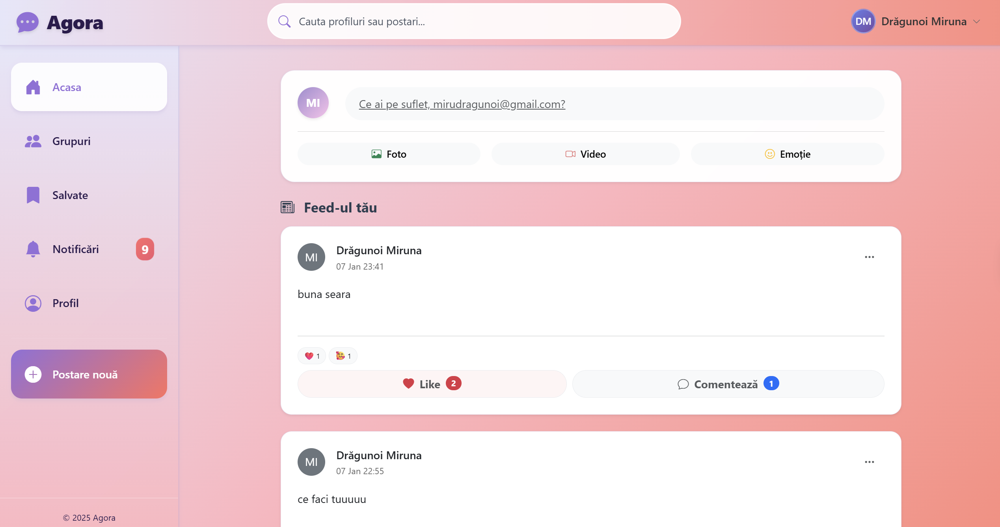
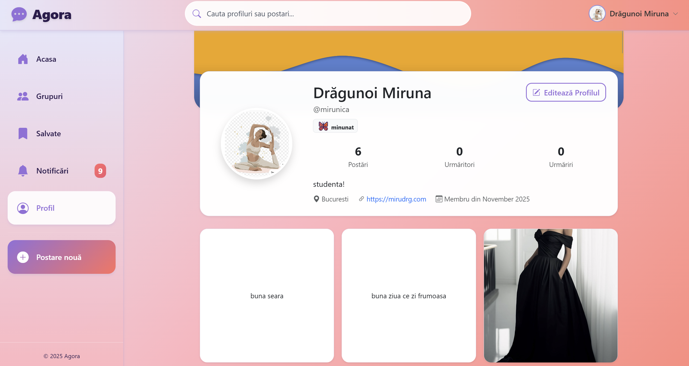
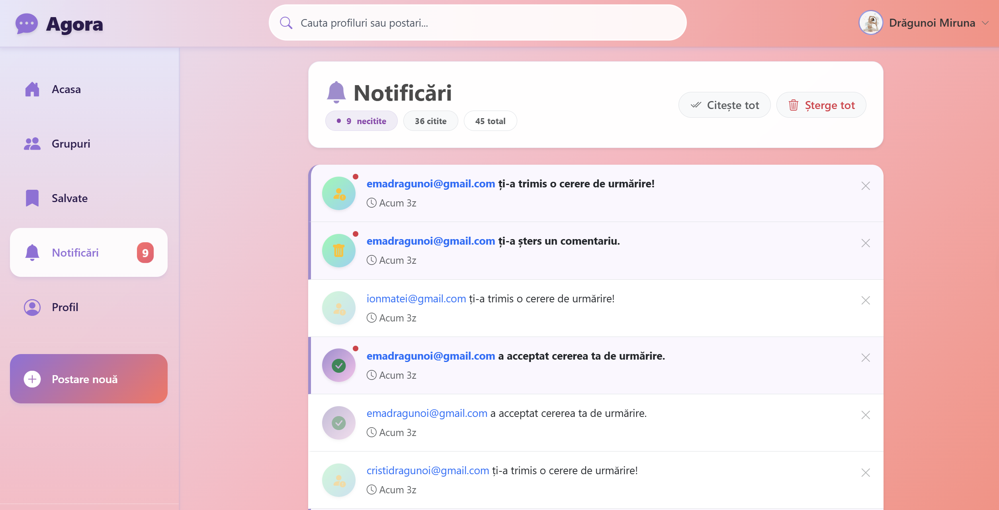
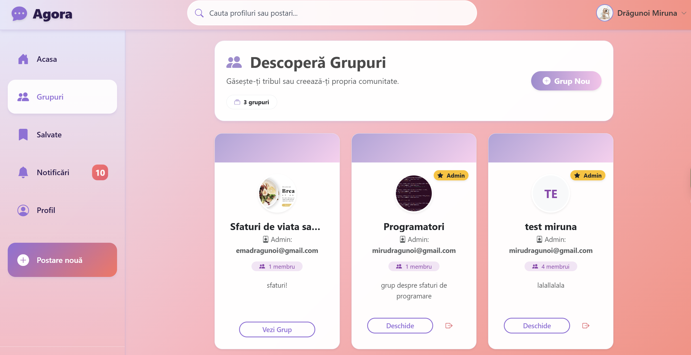
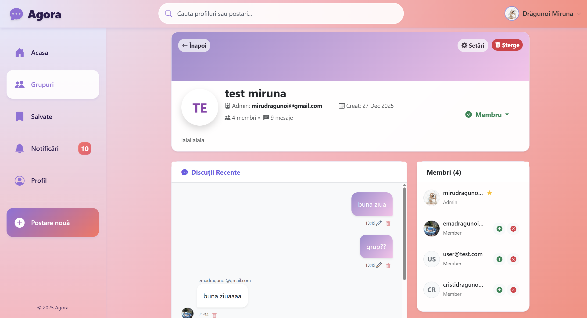
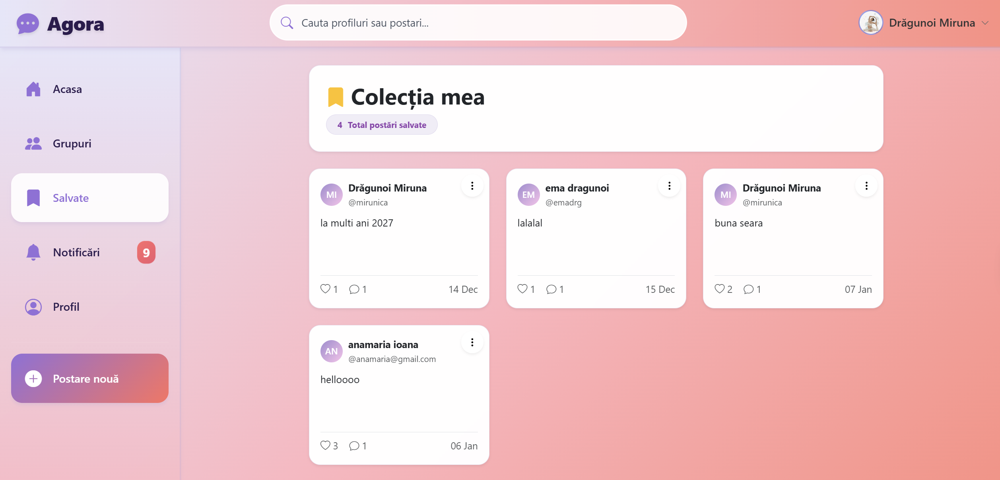
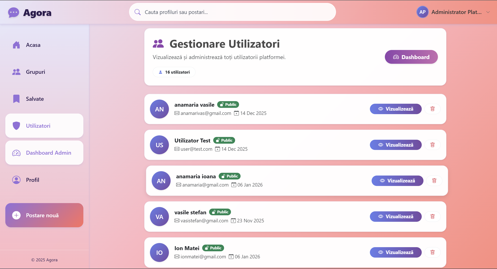

# 🌐 MicroSocialPlatform - Agora

<div align="center">


**O platformă socială modernă construită cu ASP.NET Core MVC**

[Features](#-features) • [Tech Stack](#️-tehnologii-utilizate) • [Instalare](#-instalare-și-configurare) • [Contributors](#-contributors)

</div>

---

## 📋 Despre Proiect

**MicroSocialPlatform (Agora)** este o aplicație web de tip rețea socială dezvoltată cu ASP.NET Core MVC, care permite utilizatorilor să se conecteze, să împărtășească conținut multimedia și să interacționeze într-un mediu sigur și personalizabil.

Proiectul implementează funcționalități complete de social media, inclusiv sistem de urmărire, grupuri private, notificări în timp real, și control granular al privacy-ului.

### 🎯 Scopul Proiectului

Această platformă a fost creată în cadrul disciplinei **Dezvoltarea Aplicațiilor WEB - utilizând ASP.NET Core MVC** (profesor Benegui Cezara), demonstrând implementarea unui sistem social complet cu:

- **Privacy și Control**: Profiluri publice/private cu sistem avansat de follow
- **Interacțiune Socială**: Like-uri cu reacții, comentarii, și partajare de conținut prin postări
- **Grupuri și Comunități**: Crearea și gestionarea grupurilor private
- **Notificări în Timp Real**: Sistem complet de notificări pentru toate acțiunile
- **Securitate**: Autentificare robustă cu roluri și permisiuni

---

## ✨ Features

### 👤 Managementul Utilizatorilor

#### Autentificare și Înregistrare
- ✅ Sistem complet de autentificare cu ASP.NET Core Identity
- ✅ Înregistrare cu validări personalizate (email unic, parolă securizată)
- ✅ Login cu email și parolă
- ✅ Sistem de roluri: **Administrator** și **RegisteredUser**
- ✅ Logout securizat

#### Profiluri Personalizabile
- ✅ **Poză de profil** și **cover photo** personalizabile
- ✅ **Username personalizat** (`@username`) diferit de email
- ✅ Informații complete:
  - Nume complet
  - Bio personală
  - Locație
  - Website
  - Dată de naștere
- ✅ **Status personalizat** cu emoji
- ✅ **Toggle Public/Privat**:
  - Cont public → Oricine poate urmări instant
  - Cont privat → Necesită cerere de follow și aprobare

#### Vizualizare Profile
- ✅ Profil complet cu statistici:
  - Număr postări
  - Număr urmăritori (followers)
  - Număr urmăriri (following)
- ✅ Grid de postări 
- ✅ Buton "Editează Profil" (doar pe propriul profil)
- ✅ Buton "Urmărește/Urmărești/Cerere trimisă" (pe profilurile altora)
- ✅ Badge "Profil Privat" pentru conturi private
- ✅ Badge "Mod Administrator" pentru admini care vizualizează profiluri private

---

### 📝 Postări și Conținut

#### Creare și Editare Postări
- ✅ Crearea postărilor cu:
  - Text (conținut)
  - **Imagini multiple** (upload și preview)
  - **Video-uri** (upload cu player integrat)
- ✅ Editare postări (doar owner)
- ✅ Ștergere postări (owner sau admin)
- ✅ Preview înainte de publicare

#### Vizualizare Postări
- ✅ **Feed personalizat** bazat pe relații:
  - Propriile postări
  - Postări de la utilizatori publici
  - Postări de la utilizatori privați urmăriți (cu follow acceptat)
- ✅ Click pe postare → Deschide pagina Details cu toate comentariile

#### Interacțiuni cu Postările
- ✅ **Sistem Like cu Reacții**:
  - Like simplu (❤️)
  - Reacții multiple: Love, Haha, Wow, Sad, Angry
  - Counter pentru fiecare tip de reacție
  - Badge cu numărul total de like-uri
- ✅ **Comentarii**:
  - Adaugă comentarii la postări
  - Counter pentru numărul de comentarii
  - Ștergere comentarii (owner sau admin)
- ✅ **Salvare Postări**:
  - Salvează postări în colecția personală
  - Pagină dedicată "Postări Salvate"
  - Dropdown cu opțiunea "Elimină din salvate"
  - **Auto-ștergere** când nu mai ai acces (unfollow de la cont privat)

---

### 👥 Sistem Social (Follow)

#### Follow System pentru Conturi Publice
- ✅ Urmărire instant pentru conturi publice
- ✅ Buton "Urmărește" → devine "Urmărești"
- ✅ Notificare instant către utilizatorul urmărit

#### Follow System pentru Conturi Private
- ✅ Buton "Urmărește" → trimite **cerere de follow**
- ✅ Buton devine "Cerere trimisă" (disabled)
- ✅ Notificare către utilizatorul privat
- ✅ **Pagină "Cereri de Follow"** (`/Profile/FollowRequests`):
  - Vizualizare cereri primite
  - Buton "Acceptă" (trimite notificare de acceptare)
  - Buton "Respinge" (șterge cererea)
  - Layout vertical cu animații
- ✅ **Badge pe profil** dacă cineva îți trimite cerere (apare pe propriul profil)

#### Gestionare Relații
- ✅ **Modal Followers** (Urmăritori):
  - Listă utilizatori care te urmăresc
  - Buton "Elimină" (doar pe propriul profil)
  - Buton "Vezi Profil" (pe profilurile altora)
- ✅ **Modal Following** (Urmăriri):
  - Listă utilizatori pe care îi urmărești
  - Buton "Nu mai urmări" (reload după confirmare)
  - Buton "Vezi Profil" (pe profilurile altora)
- ✅ **Unfollow**:
  - Buton "Urmărești" → click → Unfollow cu confirmare
  - Reload automat al paginii
  - **Auto-ștergere SavedPosts** de la conturi private după unfollow

#### Auto-Curățare
Când faci unfollow sau elimini un follower de la un cont privat:
- ✅ Postările salvate de la acel utilizator se șterg automat
- ✅ Previne erori "Access Denied" la postări inaccesibile

---

### 👥 Grupuri

#### Creare și Gestionare Grupuri
- ✅ Crearea grupurilor private/publice
- ✅ Rol de **Owner** (creator)
- ✅ Managementul membrilor:
  - Acceptare/Respingere cereri de join
  - Eliminare membri
  - Promovare membri la Admin

#### Membru în Grupuri
- ✅ **Solicitare de join** pentru grupuri private
- ✅ Join instant pentru grupuri publice
- ✅ **Pagină "Cereri de Join"** pentru owneri/admini
- ✅ Vizualizare membri grup
- ✅ Părăsire grup (Leave)

---

### 🔔 Sistem de Notificări

#### Funcționalități Notificări
- ✅ **Badge cu număr** pe iconița de notificări
- ✅ **Dropdown interactiv** cu ultimele 10 notificări
- ✅ **Marcare ca citită** (click pe notificare)
- ✅ **Link către resursă** (profil, postare, grup)
- ✅ **"Vezi toate"** → Pagină completă cu toate notificările
- ✅ **Ștergere notificări** individuale
- ✅ **Filtrare**: Toate / Necitite

---

### 🔒 Privacy și Securitate

#### Control Privacy
- ✅ **Profiluri Publice**:
  - Oricine poate vedea postările
  - Follow instant fără aprobare
- ✅ **Profiluri Private**:
  - Doar followerii aprobați văd postările
  - Cerere de follow necesară
  - Auto-ștergere SavedPosts după unfollow
- ✅ **Vizibilitate postări** bazată pe follow status
- ✅ **Protecție CSRF** cu ValidateAntiForgeryToken

#### Sistem de Roluri
- ✅ **Administrator**:
  - Vizualizează toate profilurile (inclusiv private)
  - Șterge orice postare
  - Gestionează utilizatori
  - Dashboard admin cu statistici
- ✅ **RegisteredUser**:
  - Acces bazat pe relații de follow
  - Editare propriile postări
  - Gestionare propriul profil

#### Validări și Securitate
- ✅ Validări personalizate la înregistrare:
  - Email unic (mesaj custom dacă există deja)
  - Parolă securizată (min. 6 caractere, literă mare, cifră)
  - Username unic (dacă se folosește custom username)
- ✅ Protecție împotriva accesului neautorizat
- ✅ Redirect automat la login pentru acțiuni care necesită autentificare

---

### 🛠️ Panoul Administrator

#### Dashboard
- ✅ **Statistici generale**:
  - Total utilizatori
  - Total postări
  - Total grupuri
  - Total notificări
  - Cereri în așteptare (follow + group join)

#### Gestionare Utilizatori
- ✅ **Pagină "Users"** (`/Admin/Users`):
  - Listă cu toți utilizatorii
  - Informații: Nume, Username, Email, Data creării, Status (Public/Privat)
  - Buton "Vizualizează" → Vezi profilul complet
  - Buton "Delete" → Șterge utilizator cu confirmare
- ✅ **Vizualizare profiluri private** (badge "Mod Administrator")

#### Gestionare Conținut
- ✅ Ștergere orice postare
- ✅ **Notificare automată** către owner când admin șterge postarea
- ✅ Vizualizare toate postările din sistem

---

### 🎨 Interfață și Design

#### UI/UX Features
- ✅ Design modern și responsive (Bootstrap 5)
- ✅ **Tema Gradient**: Purple-Pink gradient
- ✅ **Iconițe Bootstrap Icons** pentru toate acțiunile
- ✅ **Badge-uri colorate** pentru status-uri

#### Responsive Design
- ✅ Mobile-first approach
- ✅ Grid responsive pentru postări
- ✅ Navigation collapse pe mobile
- ✅ Modals adaptabile pe toate device-urile

#### Componente Reutilizabile
- ✅ `_PostCard.cshtml` - Card postare pentru feed
- ✅ `_PostGridCard.cshtml` - Card postare pentru grid (profiluri)
- ✅ `_PostSavedCard.cshtml` - Card postare pentru pagina Salvate
- ✅ `_LikePartial.cshtml` - Component pentru like-uri cu reacții
- ✅ `_FollowersListModal.cshtml` - Modal pentru urmăritori
- ✅ `_FollowingListModal.cshtml` - Modal pentru urmăriri

---

## 🛠️ Tehnologii Utilizate

### Backend
| Tehnologie | Versiune | Scop |
|------------|----------|------|
| **ASP.NET Core MVC** | 9.0+ | Framework principal |
| **Entity Framework Core** | 9.0+ | ORM pentru baza de date |
| **SQL Server / LocalDB** | - | Bază de date |
| **ASP.NET Core Identity** | 9.0+ | Autentificare și autorizare |
| **C#** | 10.0 | Limbaj de programare |

### Frontend
| Tehnologie | Versiune | Scop |
|------------|----------|------|
| **Bootstrap** | 5.3 | UI Framework |
| **Bootstrap Icons** | 1.11+ | Iconițe |
| **Razor Views** | - | Template engine |
| **JavaScript (Vanilla)** | ES6+ | Interacțiuni AJAX |
| **CSS3** | - | Styling personalizat |

### Tools și Dependențe
- **Visual Studio 2022** - IDE
- **SQL Server Management Studio** - Managementul bazei de date
- **Git** - Version control
- **NuGet** - Package manager

---

## 🚀 Instalare și Configurare

### Cerințe Prealabile
- **.NET 9.0 SDK** sau superior
- **SQL Server** sau **SQL Server LocalDB**
- **Visual Studio 2022** sau **VS Code** cu extensia C#

### Pași de Instalare

#### 1. Clone Repository
```bash
git clone https://github.com/mirunadragunoi/MicroSocialPlatform.git
cd MicroSocialPlatform
```

#### 2. Configurare Connection String
Editează `appsettings.json`:
```json
{
  "ConnectionStrings": {
    "DefaultConnection": "Server=(localdb)\\mssqllocaldb;Database=MicroSocialDB;Trusted_Connection=True;MultipleActiveResultSets=true"
  }
}
```

#### 3. Restaurare Pachete
```bash
dotnet restore
```

#### 4. Aplicare Migrări
```bash
dotnet ef database update
```

#### 5. Seed Date (Opțional)
Datele inițiale (roluri) sunt create automat la primul run prin `Program.cs`.

#### 6. Rulare Aplicație
```bash
dotnet run
```

Aplicația va fi disponibilă la: `https://localhost:7033`

---

## 👥 Utilizare

### Cont Administrator Default
După prima rulare, un cont de administrator este creat automat.

### Flow Utilizator
1. **Înregistrare** → Creează un cont nou
2. **Completare Profil** → Adaugă poză, bio, status
3. **Explorare** → Vezi feed-ul cu postări publice
4. **Follow** → Urmărește alți utilizatori
5. **Postare** → Creează postări cu text/imagini
6. **Interacțiune** → Like, comentarii, salvări
7. **Grupuri** → Creează sau join grupuri
8. **Notificări** → Primește notificări pentru toate acțiunile

---

## 📸 Screenshots

### Home Feed
Feed-ul principal cu postări de la utilizatori urmăriți și publici.



### Profile
Profil utilizator cu cover photo, statistici, și grid de postări.



### Notifications
Dropdown cu notificări în timp real + badge cu număr necitit.



### Groups
Pagină cu lista de grupuri + buton "Creează Grup Nou".



### Groups - Details
Pagina cu grupul, membrii grupului și mesajele dintre ei.



### Postări salvate - Colecție
Pagină cu postările salvate de către un user.



### Admin Dashboard
Panoul administrator cu statistici și gestionare utilizatori.




---

## 👨‍💻 Contributors

<table>
  <tr>
    <td align="center">
      <a href="https://github.com/mirunadragunoi">
        <br />
        <sub><b>Miruna Dragunoi</b></sub>
      </a><br />
      💻 🎨 
      <br/>
      <sub>Full-Stack</sub>
    </td>
    <td align="center">
      <a href="https://github.com/alexandra602">
        <br />
        <sub><b>Alexandra Panaet</b></sub>
      </a><br />
      💻 🎨
      <br/>
      <sub>Full-Stack</sub>
    </td>
  </tr>
</table>

---

## 📄 Licență

Acest proiect este realizat în scop educațional pentru materia:
**Dezvoltarea aplicațiilor WEB - utilizând ASP.NET Core MVC**

**Profesor**: Benegui Cezara  
**Universitate**: Universitatea din București, Facultatea de Matematică și Informatică
**An Academic**: 2024-2025

Toate drepturile rezervate © 2024 Miruna Dragunoi & Alexandra Panaet

---

## 📧 Contact

**Miruna Dragunoi**  
GitHub: [@mirunadragunoi](https://github.com/mirunadragunoi)  

**Alexandra Panaet**  
GitHub: [@alexandra602](https://github.com/alexandra602)  

---

<div align="center">

### ⭐ Dacă îți place acest proiect, lasă un star pe GitHub! ⭐

Made with ❤️ and lots of ☕ by the **MicroSocialPlatform Team**

**[⬆ Back to Top](#-microsocialplatform---agora)**

---


</div>
